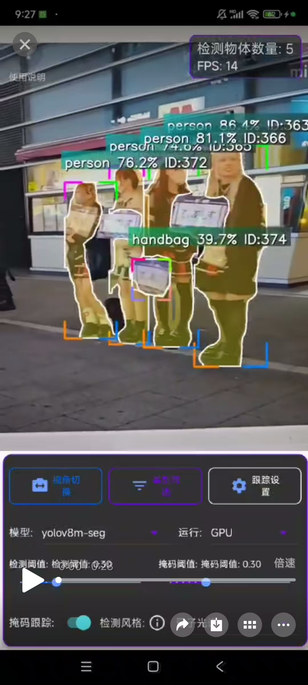
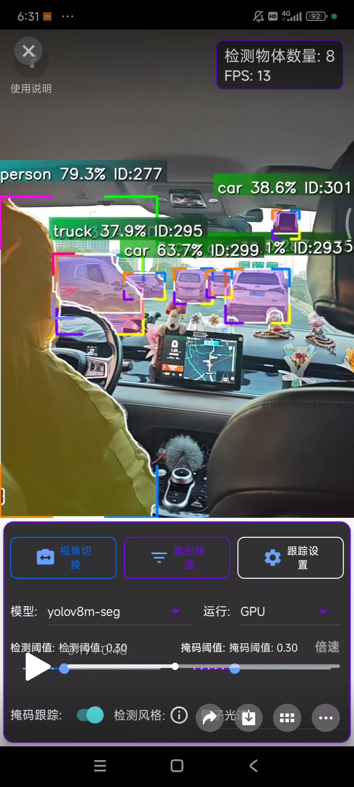
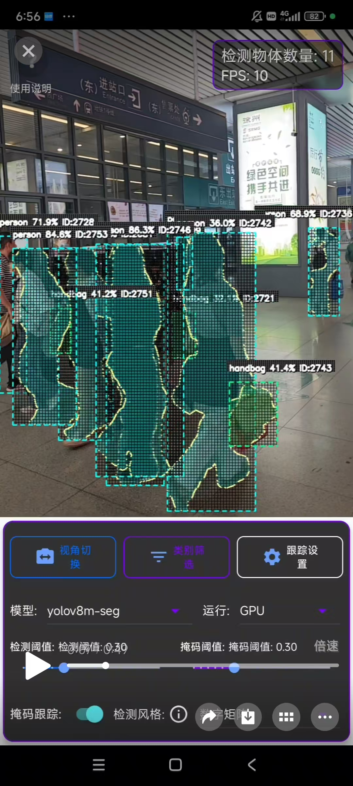
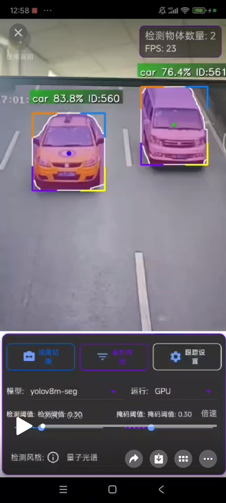

# AICV-Mobile 安卓端实时目标检测app (中文)

[](https://opensource.org/licenses/MIT)
[](https://github.com/dmwzw/AICV-Mobile/stargazers)
[](CONTRIBUTING.md)
**Author:** [dmwzw](https://github.com/dmwzw) ([1669406579@qq.com](mailto:1669406579@qq.com))
**Latest Release Apk Download:** [AICV-Mobile-V1.0 (Pre-release)](https://github.com/dmwzw/AICV-Mobile/releases/tag/AI)

## 项目简介

AICV-Mobile 是一个基于YOLOv8和改进版OC-SORT算法的安卓端实时目标检测app，专为Android平台设计和优化。本项目实现了高效的目标检测、实例分割及目标跟踪功能，并支持掩码（分割）跟踪，能够实时跟踪目标的形状变化。

<details>
<summary>目录 (Table of Contents)</summary>

- [项目简介](#项目简介)
- [功能特点](#功能特点)
- [效果演示](#效果演示)
- [技术实现](#技术实现)
  - [目标跟踪机理](#目标跟踪机理)
  - [掩码跟踪机理](#掩码跟踪机理)
  - [错误处理](#错误处理)
- [系统要求](#系统要求)
- [编译与安装](#编译与安装)
  - [前提条件](#前提条件)
  - [编译步骤](#编译步骤)
- [使用指南](#使用指南)
  - [基本使用](#基本使用)
  - [设置选项](#设置选项)
- [代码结构](#代码结构)
  - [关键组件 C](#关键组件-c)
- [贡献指南](#贡献指南)
- [许可证](#许可证)
- [致谢](#致谢)
- [联系方式](#联系方式)
- [English Version](#aicv-mobile-real-time-android-object-detection-app-english)

</details>

## 功能特点 ✨

-   🚀 **高效目标检测**：基于YOLOv8模型，支持COCO数据集80类通用目标检测
-   🎨 **实例分割**：支持物体的精确分割，生成掩码
-   🎯 **目标跟踪**：实现了改进版OC-SORT算法，结合卡尔曼滤波器提高跟踪精度
-   🎭 **掩码跟踪**：能够跟踪目标形状变化，支持掩码预测和时间域平滑
-   🌈 **多样化显示风格**：支持多种检测框、掩码和轨迹的显示风格
-   📈 **轨迹可视化**：可显示目标的运动轨迹线
-   ⚡ **性能优化**：针对移动设备进行了性能优化，禁用C++异常处理

## 效果演示 🎬

| 演示 1 | 演示 2 | 演示 3 | 演示 4 |
| :----: | :----: | :----: | :----: |
| [](app/demo/1.mp4) | [](app/demo/2.mp4) | [](app/demo/3.mp4) | [](app/demo/4.mp4) |

*点击图片查看对应的演示视频*

## 技术实现 ⚙️

### 目标跟踪机理

本项目采用改进版的OC-SORT (Observation-Centric SORT) 思想，并结合卡尔曼滤波器 (Kalman Filter) 进行目标跟踪，以提高精度和鲁棒性：

1.  **预测阶段**：使用卡尔曼滤波预测每个跟踪对象的下一帧状态（位置、速度等）。
2.  **关联阶段**：计算预测位置与当前帧检测结果之间的关联代价（综合IoU、距离等），并使用匈牙利算法或贪婪算法进行匹配。
3.  **更新阶段**：使用匹配成功的检测结果更新对应跟踪对象的卡尔曼滤波器状态。
4.  **生命周期管理**：处理未匹配的检测（创建新轨迹）和未匹配的跟踪（标记丢失、删除超时轨迹）。

### 掩码跟踪机理

1.  **掩码历史**：每个跟踪对象保存最近若干帧的掩码历史。
2.  **掩码预测**：当目标丢失（检测失败）但跟踪保持时，基于运动预测变换（如仿射变换 `warpAffine`）上一帧的掩码。
3.  **掩码平滑**：使用时间域加权平均减少掩码抖动。

### 错误处理

由于项目禁用了C++异常处理以提高性能，采用了多层次的错误处理策略，包括预防性检查、容错机制和日志记录。

## 系统要求 📱

- Android 6.0 (API 23) 或更高版本
- ARMv8 (arm64-v8a) 架构
- 具有摄像头的设备
- 至少2GB RAM

## 编译与安装 🛠️

### 前提条件

- Android Studio 4.0+
- NDK r21+
- CMake 3.18+
- OpenCV Mobile 4.6.0
- NCNN 20230223+

### 编译步骤

1.  克隆代码库
    ```bash
    git clone https://github.com/your-username/AICV-Mobile.git
    cd AICV-Mobile
    ```
2.  在Android Studio中打开项目
3.  同步Gradle文件
4.  编译并安装到设备
    ```bash
    ./gradlew assembleDebug
    adb install -r app/build/outputs/apk/debug/app-debug.apk
    ```

## 使用指南 📖

### 基本使用

1.  启动应用，允许摄像头权限
2.  将摄像头对准需要检测的目标
3.  应用会自动进行检测和跟踪，显示边界框、类别、置信度、跟踪ID和轨迹线（如果启用）

### 设置选项

-   **检测/显示风格**：选择边界框、文本、掩码和轨迹的显示风格
-   **掩码阈值**：调整分割掩码的阈值
-   **启用/禁用跟踪**：仅进行检测
-   **启用/禁用掩码跟踪**
-   **启用/禁用轨迹显示**：可设置轨迹长度和样式
-   **跟踪模式**：选择不同的跟踪策略（如稳定模式、手持模式等）

## 代码结构 📁

```
app/src/main/
├── java/                # Java代码 (UI, 相机交互, 设置管理)
│   ├── com/gyq/        # 主包
│   └── ylov/colorpicker# 颜色选择器组件
├── jni/                # C++代码 (算法核心)
│   ├── yolo.cpp        # YOLO检测实现
│   ├── yolo.h          # YOLO类定义
│   ├── yolov8ncnn.cpp  # JNI接口实现
│   ├── EnhancedTracker.h # 增强版跟踪器 (整合OC-SORT思想+Kalman)
│   ├── OCsort.h        # 基础OC-SORT实现 (可能作为参考或部分使用)
│   ├── Object.h        # 检测/跟踪对象结构定义
│   ├── TrackingParams.h # 跟踪参数定义
│   ├── ndkcamera.cpp   # 相机接口实现 (C++)
│   └── ndkcamera.h     # 相机接口定义 (C++)
└── assets/             # 模型文件目录 (YOLO模型 *.bin/*.param)
```

### 关键组件 (C++)

-   `Yolo` 类: 负责模型加载、推理、后处理和结果绘制。
-   `OCSort` 类: 实现基础版 OC-SORT 算法。
-   `EnhancedTracking` 类: 增强版跟踪器，整合卡尔曼滤波和 OC-SORT 思想，支持掩码跟踪。
-   `TrackingParams` 结构体: 定义跟踪参数。
-   `Object` 结构体: 表示检测和跟踪的目标对象。

## 贡献指南 🙌

1.  Fork项目
2.  创建功能分支 (`git checkout -b feature/amazing-feature`)
3.  提交更改 (`git commit -m 'Add some amazing feature'`)
4.  推送到分支 (`git push origin feature/amazing-feature`)
5.  创建Pull Request

## 许可证 📜

本项目采用 MIT 许可证 - 详情请参见 `LICENSE` 文件 (如果存在)。

## 致谢 🙏

-   [YOLO / Ultralytics](https://github.com/ultralytics/ultralytics)
-   [OC-SORT Paper / Authors](https://arxiv.org/abs/2203.14360)
-   [NCNN / Tencent](https://github.com/Tencent/ncnn)
-   [OpenCV](https://opencv.org/)
-   [ncnn-android-yolov8 / nihui](https://github.com/nihui/ncnn-android-yolov8.git)
-   [OC_SORT_CPP / Postroggy](https://github.com/Postroggy/OC_SORT_CPP.git)

## 联系方式 📧

-   项目仓库: [https://github.com/dmwzw/AICV-Mobile](https://github.com/dmwzw/AICV-Mobile)

---

# AICV-Mobile Real-time Android Object Detection App (English)

[](https://opensource.org/licenses/MIT)
[](https://github.com/dmwzw/AICV-Mobile/stargazers)
[](CONTRIBUTING.md)
**Author:** [dmwzw](https://github.com/dmwzw) ([1669406579@qq.com](mailto:1669406579@qq.com))
**Latest Release:** [AICV-Mobile-V1.0 (Pre-release)](https://github.com/dmwzw/AICV-Mobile/releases/tag/AI)

## Introduction

AICV-Mobile is an object detection and tracking system based on YOLOv8 and an improved OC-SORT algorithm, designed and optimized for the Android platform. This project implements efficient object detection, instance segmentation, and object tracking, including mask (segmentation) tracking to follow the shape changes of targets in real-time.

<details>
<summary>Table of Contents</summary>

- [Introduction](#introduction)
- [Features](#features)
- [Demo Video](#demo-video)
- [Technical Implementation](#technical-implementation)
  - [Object Tracking Mechanism](#object-tracking-mechanism)
  - [Mask Tracking Mechanism](#mask-tracking-mechanism)
  - [Error Handling](#error-handling)
- [System Requirements](#system-requirements)
- [Compilation and Installation](#compilation-and-installation)
  - [Prerequisites](#prerequisites)
  - [Compilation Steps](#compilation-steps)
- [Usage Guide](#usage-guide)
  - [Basic Usage](#basic-usage)
  - [Settings Options](#settings-options)
- [Code Structure](#code-structure)
  - [Key Components C](#key-components-c)
- [Contribution Guidelines](#contribution-guidelines)
- [License](#license)
- [Acknowledgements](#acknowledgements)
- [Contact](#contact)
- [中文版本](#aicv-mobile-安卓端实时目标检测app-中文)

</details>

## Features ✨

-   🚀 **Efficient Object Detection**: Based on the YOLOv8 model, supports detection of 80 common object classes from the COCO dataset.
-   🎨 **Instance Segmentation**: Supports precise object segmentation to generate masks.
-   🎯 **Object Tracking**: Implements an improved OC-SORT algorithm combined with a Kalman filter for enhanced tracking accuracy.
-   🎭 **Mask Tracking**: Capable of tracking target shape changes, supporting mask prediction and temporal smoothing.
-   🌈 **Diverse Display Styles**: Supports various display styles for bounding boxes, masks, and trajectories.
-   📈 **Trajectory Visualization**: Can display the motion paths of targets.
-   ⚡ **Performance Optimization**: Optimized for mobile devices, including disabling C++ exception handling.

## Demo Video 🎬

| Demo 1 | Demo 2 | Demo 3 | Demo 4 |
| :----: | :----: | :----: | :----: |
| [](app/demo/1.mp4) | [](app/demo/2.mp4) | [](app/demo/3.mp4) | [](app/demo/4.mp4) |

*Click the images to view the corresponding demo videos*

## Technical Implementation ⚙️

### Object Tracking Mechanism

This project utilizes concepts from the improved OC-SORT (Observation-Centric SORT) algorithm combined with a Kalman Filter for target tracking, enhancing accuracy and robustness:

1.  **Prediction Stage**: Uses the Kalman filter to predict the next state (position, velocity, etc.) of each tracked object.
2.  **Association Stage**: Calculates the association cost (combining IoU, distance, etc.) between predicted locations and current frame detections, using algorithms like Hungarian or greedy matching.
3.  **Update Stage**: Updates the Kalman filter state of matched tracked objects using the corresponding successful detections.
4.  **Lifecycle Management**: Handles unmatched detections (creating new tracks) and unmatched tracks (marking as lost, deleting timed-out tracks).

### Mask Tracking Mechanism

1.  **Mask History**: Each tracked object maintains a history of masks from recent frames.
2.  **Mask Prediction**: When a target is lost (detection fails) but tracking is maintained, the previous frame's mask is transformed based on motion prediction (e.g., using affine transformation `warpAffine`).
3.  **Mask Smoothing**: Uses temporal weighted averaging to reduce mask jitter.

### Error Handling

As C++ exception handling is disabled for performance, a multi-layered error handling strategy is employed, including preventative checks, fault tolerance mechanisms, and logging.

## System Requirements 📱

-   Android 6.0 (API 23) or higher
-   ARMv8 (arm64-v8a) architecture
-   Device with a camera
-   At least 2GB RAM

## Compilation and Installation 🛠️

### Prerequisites

-   Android Studio 4.0+
-   NDK r21+
-   CMake 3.18+
-   OpenCV Mobile 4.6.0
-   NCNN 20230223+

### Compilation Steps

1.  Clone the repository
    ```bash
    git clone https://github.com/your-username/AICV-Mobile.git
    cd AICV-Mobile
    ```
2.  Open the project in Android Studio
3.  Sync Gradle files
4.  Compile and install on the device
    ```bash
    ./gradlew assembleDebug
    adb install -r app/build/outputs/apk/debug/app-debug.apk
    ```

## Usage Guide 📖

### Basic Usage

1.  Launch the application, grant camera permissions.
2.  Point the camera at the objects to be detected.
3.  The application will automatically perform detection and tracking, displaying bounding boxes, labels, confidence scores, tracking IDs, and trajectories (if enabled).

### Settings Options

-   **Detection/Display Style**: Choose display styles for bounding boxes, text, masks, and trajectories.
-   **Mask Threshold**: Adjust the threshold for segmentation masks.
-   **Enable/Disable Tracking**: Perform detection only.
-   **Enable/Disable Mask Tracking**.
-   **Enable/Disable Trajectory Display**: Configure trajectory length and style.
-   **Tracking Mode**: Select different tracking strategies (e.g., Stable Mode, Handheld Mode).

## Code Structure 📁

```
app/src/main/
├── java/                # Java code (UI, Camera Interaction, Settings Management)
│   ├── com/gyq/        # Main package
│   └── ylov/colorpicker# Color picker component
├── jni/                # C++ code (Core algorithms)
│   ├── yolo.cpp        # YOLO detection implementation
│   ├── yolo.h          # YOLO class definition
│   ├── yolov8ncnn.cpp  # JNI interface implementation
│   ├── EnhancedTracker.h # Enhanced tracker (integrating OC-SORT ideas + Kalman)
│   ├── OCsort.h        # Basic OC-SORT implementation (potentially for reference or partial use)
│   ├── Object.h        # Detection/Tracking object structure definition
│   ├── TrackingParams.h # Tracking parameters definition
│   ├── ndkcamera.cpp   # Camera interface implementation (C++)
│   └── ndkcamera.h     # Camera interface definition (C++)
└── assets/             # Model files directory (YOLO models *.bin/*.param)
```

### Key Components (C++)

-   `Yolo` Class: Responsible for model loading, inference, post-processing, and drawing results.
-   `OCSort` Class: Implements the basic OC-SORT algorithm.
-   `EnhancedTracking` Class: Enhanced tracker integrating Kalman filter and OC-SORT concepts, supporting mask tracking.
-   `TrackingParams` Struct: Defines tracking parameters.
-   `Object` Struct: Represents detected and tracked target objects.

## Contribution Guidelines 🙌

1.  Fork the project
2.  Create a feature branch (`git checkout -b feature/amazing-feature`)
3.  Commit your changes (`git commit -m 'Add some amazing feature'`)
4.  Push to the branch (`git push origin feature/amazing-feature`)
5.  Create a Pull Request

## License 📜

This project is licensed under the MIT License - see the `LICENSE` file (if available) for details.

## Acknowledgements 🙏

-   [YOLO / Ultralytics](https://github.com/ultralytics/ultralytics)
-   [OC-SORT Paper / Authors](https://arxiv.org/abs/2203.14360)
-   [NCNN / Tencent](https://github.com/Tencent/ncnn)
-   [OpenCV](https://opencv.org/)
-   [ncnn-android-yolov8 / nihui](https://github.com/nihui/ncnn-android-yolov8.git)
-   [OC_SORT_CPP / Postroggy](https://github.com/Postroggy/OC_SORT_CPP.git)

## Contact 📧

-   Project Repository: [https://github.com/dmwzw/AICV-Mobile](https://github.com/dmwzw/AICV-Mobile) 
